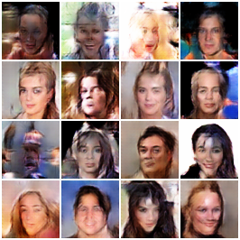

# GAN Face Generator

An end-to-end Deep Learning web application that uses a trained **Deep Convolutional Generative Adversarial Network (DCGAN)** to generate realistic, synthetic 64×64 RGB human faces from random latent noise vectors.



---

## Overview

The **GAN Face Generator** project demonstrates synthetic human face synthesis through adversarial deep learning. The application takes a 100-dimensional Gaussian noise vector $Z \sim \mathcal{N}(0, 1)$ and passes it through a PyTorch Generator network trained to capture complex visual feature distributions of human faces.

The project features a high-performance **FastAPI** backend API coupled with a modern **Tailwind CSS** AI dashboard interface, complete with a persistent session gallery, zero-padded image downloading, batch generation, and dynamic model inspection.

---

## CPU Deployment Suitability

| Parameter | Feasibility Assessment | Status |
|---|---|:---:|
| **Model Size** | `generator.pth` is **14.3 MB** (3,576,704 float32 parameters). | `Optimal` |
| **Memory Footprint** | Peak RAM consumption is **~180 MB – 250 MB RSS RAM**. | `Fits 512MB RAM` |
| **Compute Complexity** | Single forward pass requires **~0.08 GFLOPs** (80M floating point ops). | `Low Latency` |
| **CPU Latency** | Single image inference takes **~15ms – 30ms** on 1 vCPU. | `Real-time` |

---

## Recommended Deployment Platforms

1. **Render.com (Web Service)** — *Recommended*
   - Free tier includes 512MB RAM, automatic HTTPS, and direct GitHub integration.
   - Deploy using the included [`render.yaml`](render.yaml) blueprint or [`Procfile`](Procfile).
2. **Hugging Face Spaces (Docker / FastAPI)**
   - Free CPU tier provides 2 vCPU and 16GB RAM.
   - Deploy directly using the provided [`Dockerfile`](Dockerfile).

---

## Features

- 🎭 **AI-Generated Faces**: Synthesizes unique human faces from random noise vectors.
- 👤 **Single Face Generation**: Instant sampling of individual faces with seed control.
- 🖼️ **Batch Generation**: Generate multiple faces simultaneously in responsive grid layouts.
- 🎲 **Random Seed Control**: Reproducible sampling using deterministic seed values (`#42`, `#777`, etc.).
- 🔍 **Interactive Lightbox Inspection**: Click any generated image to view an enlarged view with seed details.
- 🎨 **Pixel Rendering Toggle**: Toggle between **Crisp Pixels** and **Smooth** mode to evaluate 64×64 model outputs.
- 📁 **Interactive Session Gallery**: Session-persistent image gallery with single-item regeneration (`Regen`).
- 📦 **Robust Image Download**:
  - Download individual faces with standardized zero-padded filenames (`gan_face_001.png`, `gan_face_002.png`).
  - One-click **Download All (ZIP)** archive generation (`gan_faces_batch.zip`).
- ⚙️ **Dynamic Model Information**: Real-time backend model inspection endpoint (`GET /model-info`).
- 💻 **Modern Web Dashboard**: Responsive AI/ML dashboard built with Tailwind CSS, skeleton loaders, and ARIA tags.

---

## Architecture & How It Works

### Inference Pipeline
```text
Latent Vector Z (100D) ➔ PyTorch Generator (5 Transposed Convs) ➔ Synthetic Face (64×64 RGB)
```

### Training Minimax Mechanics
```text
Real Training Images ──┐
                       ├──> Discriminator (Binary Classifier) ➔ Real / Fake Score
Synthetic GAN Faces ──┘
```

During training, two neural networks compete in a zero-sum minimax game:
- **Generator**: Upscales a 100-dimensional noise vector into a 64×64 RGB image using 5 transposed convolutional layers with Batch Normalization and `Tanh()` output activation.
- **Discriminator**: Evaluates real human face images versus synthetic outputs, outputting a probability score $P(\text{Real}) \in [0, 1]$.
- **Inference Engine**: Once training is complete, only the trained Generator (`generator.pth`) is required to sample new faces in production.

---

## Technologies Used

- **Deep Learning Framework**: [PyTorch 2.x](https://pytorch.org/) (`torch`, `torch.nn`)
- **Neural Network Architecture**: DCGAN (Deep Convolutional GAN)
- **Backend API Framework**: [FastAPI](https://fastapi.tiangolo.com/) & [Uvicorn](https://www.uvicorn.org/)
- **Numerical & Image Processing**: [NumPy](https://numpy.org/) & [Pillow (PIL)](https://python-pillow.org/)
- **Data Validation & Settings**: [Pydantic v2](https://docs.pydantic.dev/)
- **Frontend Dashboard**: HTML5, [Tailwind CSS](https://tailwindcss.com/), ES6 JavaScript

---

## Project Structure

```text
GANs/
├── .env.example              # Environment variables template
├── .gitignore                # Production Git ignore rules (secrets, venv, caches)
├── Dockerfile                # Production Docker container configuration
├── Procfile                  # Cloud process file for Heroku / Render
├── render.yaml               # Render.com infrastructure blueprint
├── README.md                 # Project documentation
├── requirements.txt          # Python package dependencies
├── generator.pth             # Trained PyTorch Generator weights (14.3 MB, 3.57M params)
├── generator.py              # PyTorch Generator class definition (DCGAN architecture)
├── pipeline_utils.py         # Postprocessing & denormalization pipeline
├── main.py                   # FastAPI backend server & inference API endpoints
├── generate_samples.py       # Sample generation script
├── test_backend.py           # Backend pytest suite (10 test scenarios)
├── test_pipeline_audit.py    # Empirical pipeline audit script
├── templates/
│   └── index.html            # Main web dashboard HTML interface
├── static/
│   ├── css/
│   │   └── style.css         # Custom animations & pixel rendering CSS
│   └── js/
│       └── app.js            # Client JavaScript & backend API integration
└── outputs/
    └── final_samples/        # Phase 1 verification output face PNGs
```

---

## Model Weights & File Storage Note

The model file `generator.pth` is **~14.3 MB**, which is well under GitHub's **100 MB single file limit**. Therefore, it can be committed directly to standard Git tracking without requiring external LFS or cloud storage buckets.

For larger neural network models (>100 MB):
- Use **Git LFS** (`git lfs track "*.pth"`).
- Or host weights on **Hugging Face Hub** / **AWS S3** and download dynamically on startup.

---

## Local Environment Setup & Installation

1. **Clone Repository**:
   ```powershell
   git clone https://github.com/your-username/gan-face-generator.git
   cd gan-face-generator
   ```

2. **Create & Activate Virtual Environment**:
   ```powershell
   python -m venv venv
   .\venv\Scripts\Activate.ps1
   ```

3. **Install Dependencies**:
   ```powershell
   pip install -r requirements.txt
   ```

4. **Environment Variables** (Optional):
   Copy `.env.example` to `.env`:
   ```powershell
   cp .env.example .env
   ```

---

## Running the Backend Server

Start the FastAPI server:

```powershell
python main.py
```
*(Or via Uvicorn: `uvicorn main:app --host 0.0.0.0 --port 8000 --reload`)*

- Web Dashboard: **[http://127.0.0.1:8000](http://127.0.0.1:8000)**
- Swagger API Docs: **[http://127.0.0.1:8000/docs](http://127.0.0.1:8000/docs)**

---

## Deployment Instructions

### Option 1: Render.com Blueprint (1-Click)
1. Push this repository to GitHub.
2. Log into [Render.com](https://render.com) and click **New +** ➔ **Blueprint**.
3. Connect your GitHub repository. Render will read [`render.yaml`](render.yaml) and deploy automatically.

### Option 2: Docker Container Deployment
1. Build Docker image:
   ```bash
   docker build -t gan-face-generator .
   ```
2. Run container:
   ```bash
   docker run -d -p 8000:8000 --name gan-face-generator gan-face-generator
   ```

### Option 3: Hugging Face Spaces (Docker)
1. Create a new Space on [Hugging Face](https://huggingface.co/spaces) and select **Docker**.
2. Push your repository to Hugging Face. The Space will build using [`Dockerfile`](Dockerfile) and launch on CPU.

---

## API Endpoints Specification

| Method | Endpoint | Description |
|:---:|---|---|
| `GET` | `/` | Serves the main web dashboard interface ([index.html](templates/index.html)) |
| `GET` | `/health` | Returns backend readiness, device type (`cpu`/`cuda`), and model state |
| `GET` | `/model-info` | Returns dynamic model specs (architecture, resolution, channels, latent size) |
| `POST` | `/generate` | Generates 1 face from a 100D latent vector (returns base64 JSON or PNG bytes) |
| `POST` | `/generate-batch` | Generates a batch of synthetic faces (1 to 16 faces) |
| `POST` | `/download-zip` | Packages generated face PNGs into a downloadable `gan_faces_batch.zip` archive |

---

## Running Tests

Run the complete backend pytest suite:

```powershell
python -m pytest test_backend.py -v
```

Run the empirical pipeline audit script:

```powershell
python test_pipeline_audit.py
```

---

## Disclaimer

⚠️ **Synthetic Media Notice**: All faces generated by this project are 100% artificial synthetic images produced by a Deep Convolutional Generative Adversarial Network. They do not represent real living or historical individuals.
